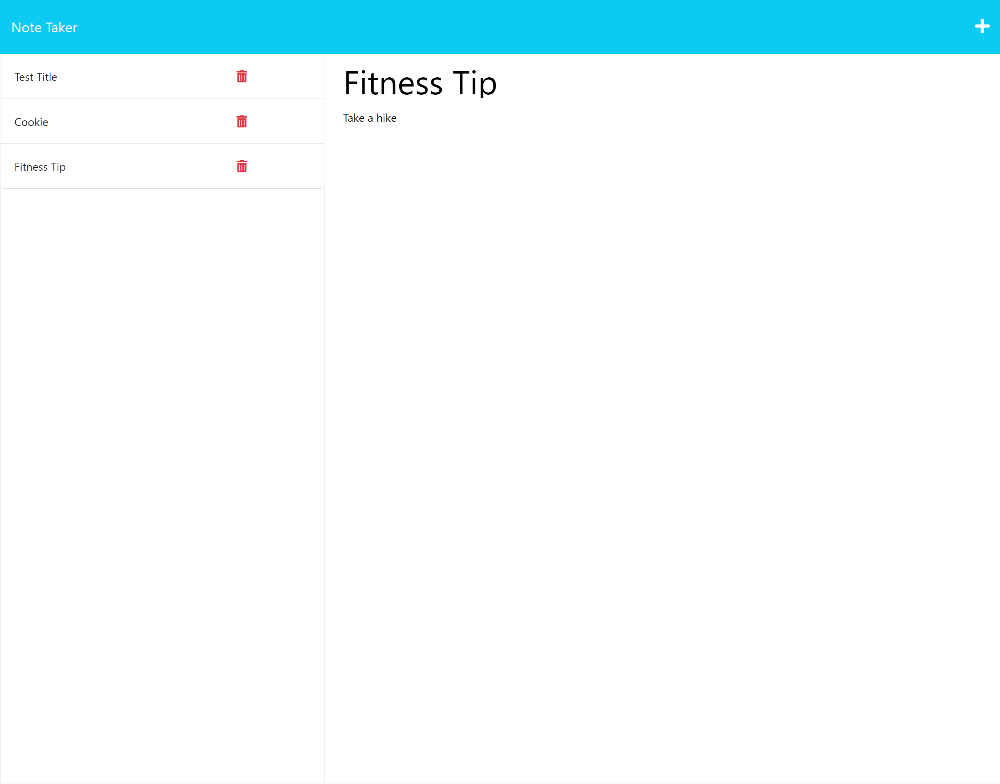

# Note-Taker App
## Description
A note taking application that combines the "node fs" module to create read and write functionality to database file and "express" to create a backend server architecture.
## Table of Contents

- [Description](#description)
- [Installation](#installation)
- [Usage](#usage)
- [Questions](#questions)
## Installation
[This is application is deployed here.](https://murmuring-basin-69035-c1f2c6061b68.herokuapp.com/)

## Usage
When a user creates a note, they are able to save the notes to a db and view all notes saved on the left-hand side.

## Questions
For any questions you can reach out to me at:

My Email: [ziad.t.alfadl@gmail.com](mailto:ziad.t.alfadl@gmail.com)

My GitHub: [https://github.com/Z-Alfadl](https://github.com/Z-Alfadl)
